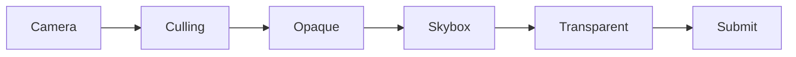

SRP（Scriptable Render Pipeline）让开发者能够通过 C# 组织 Unity 的渲染流程。它不是单个渲染效果，而是一套决定“场景如何变成最终画面”的框架。

## 一帧画面经历了什么

从宏观上看，一帧渲染通常包含这些步骤：

1. 获取需要渲染的相机；
2. 对场景进行剔除，排除不可见物体；
3. 设置相机和全局渲染状态；
4. 绘制不透明物体；
5. 绘制天空盒；
6. 绘制透明物体；
7. 提交命令，输出最终画面。

## SRP 的核心对象

`RenderPipelineAsset` 负责保存配置并创建管线实例，`RenderPipeline` 负责执行每一帧的渲染。实际绘制时，通过 `ScriptableRenderContext` 调度命令，再使用 `CommandBuffer` 描述需要提交给 GPU 的操作。

## 推荐学习顺序

- 先完成一个只绘制基础物体的最小管线；
- 理解 Culling、Sorting 和 DrawingSettings；
- 加入阴影与多光源；
- 学习 RenderTexture、后处理和屏幕后效；
- 最后再研究 URP 的 Renderer Feature 与 RenderGraph。

后续文章会从最小可运行代码开始，逐步拆解每个阶段。
